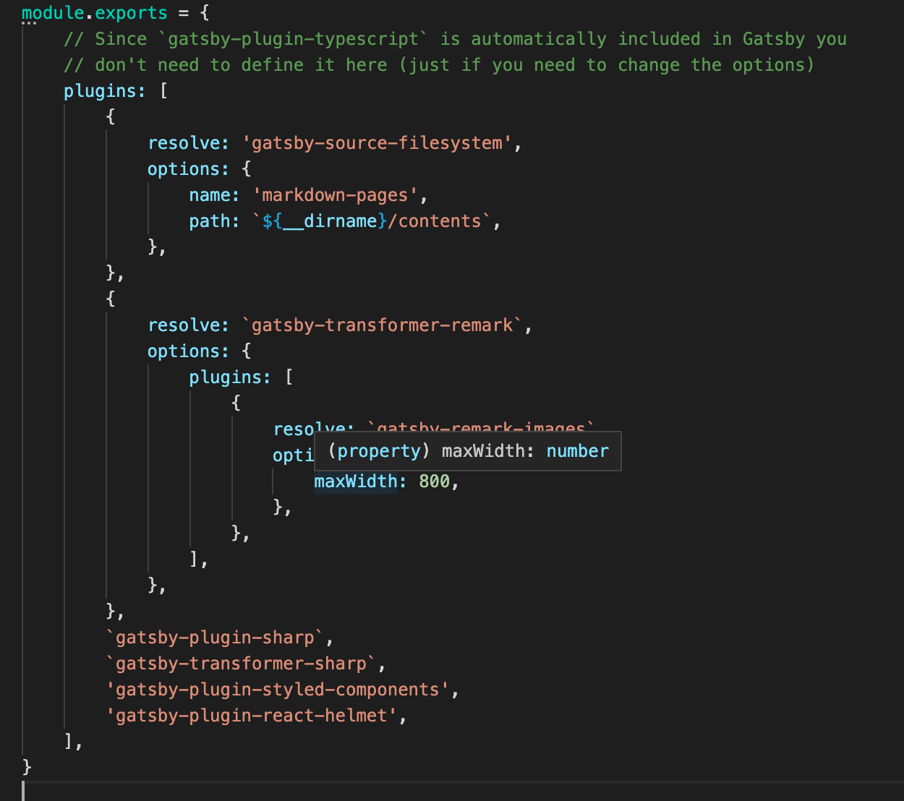
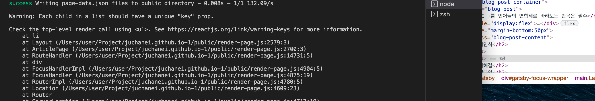

## 문제인식

C++는 제공하는 기능이 어마어마하고 강력합니다. C++에서 뿜어져 나오는 강력한 힘을 주체하지 못하고 마구 휘두르지 않고, C++를 올바로 사용하는 방법에 대해 잘 알아야 할 필요가 있습니다.
예를들어, 함수에 객체를 넘기는 경우를 생각해 봅시다.
C스타일의 C++에서는 *값에 의한 전달* 이 더 효율이 좋다고 알려져 있습니다. 하지만 객체 지향 C++에서는 *상수 객체 참조자에 의한 전달* 이 더 효율이 좋습니다. 반면 STL에서는 다시 *값에 의한 전달* 이 더 효율이 좋다고 하는군요. 어떤게 옳을까요?

## 문제해결

### 패러다임

C++는 **다중패러다임 프로그래밍 언어** 입니다. C++는 다음과 같은 패러다임을 지원합니다.

- 절차적 *procedural* 프로그래밍
- 객체 지향 *object-oriendted* 프로그래밍
- 함수형 *functional* 프로그래밍
- 일반화 *generic* 프로그래밍
- 메타 프로그래밍 *metaprogramming*

C++이 지원하는 패러다임을 제대로 알고 사용하는 법은, 각 패러다임의 C++를 하나의 하위언어로 생각하고 각각의 규칙을 익히는 것입니다. C++는 네개의 하위언어로 구분할 수 있습니다.

- C언어
- 객체 지향 개념의 C++
- 템플릿 C++ *templete metaprogramming*
- STL

## 정리

- C++은 *다중패러다임 프로그래밍 언어* 입니다.
- C++은 *언어 연합체* 입니다. *통합 언어* 가 아닙니다.
